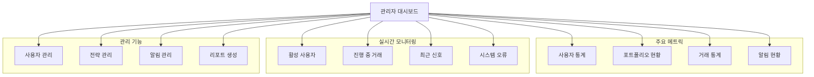
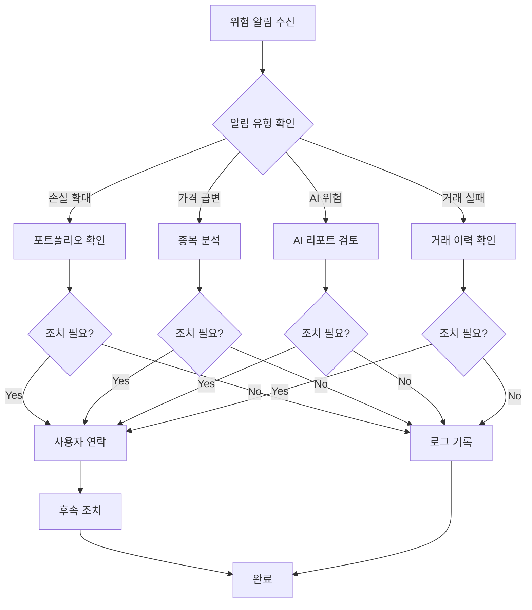

# 관리자용 가이드 (Administrator Guide)

## 목차
- [관리자 대시보드](#관리자-대시보드)
- [사용자 계정 관리](#사용자-계정-관리)
- [포트폴리오 모니터링](#포트폴리오-모니터링)
- [매매 전략 관리](#매매-전략-관리)
- [알림 관리](#알림-관리)
- [AI 분석 결과 확인](#ai-분석-결과-확인)
- [리포트 생성](#리포트-생성)
- [위험 관리](#위험-관리)

---

## 관리자 대시보드

### 대시보드 접속

**URL**: `http://localhost:3000/admin/dashboard`

**권한**: 관리자 계정만 접근 가능

### 대시보드 구성



### 주요 지표

| 지표 | 설명 | 정상 범위 |
|------|------|-----------|
| **총 사용자 수** | 등록된 사용자 수 | - |
| **활성 사용자** | 최근 7일 내 로그인한 사용자 | > 50% |
| **총 포트폴리오 가치** | 전체 포트폴리오 평가액 합계 | - |
| **평균 수익률** | 사용자 평균 수익률 | > 0% |
| **일일 거래 건수** | 당일 체결된 거래 수 | - |
| **거래 성공률** | 체결된 거래 / 전체 거래 | > 90% |
| **활성 알림 수** | 설정된 활성 알림 개수 | - |
| **미읽음 알림** | 사용자별 미읽음 알림 평균 | < 50 |

---

## 사용자 계정 관리

### 사용자 목록 조회

**API 엔드포인트**
```http
GET /api/admin/users?page=1&limit=50&status=active&sort=createdAt:desc
Authorization: Bearer <admin-token>
```

**응답 예시**
```json
{
  "users": [
    {
      "id": "user-id",
      "email": "user@example.com",
      "name": "홍길동",
      "emailVerified": true,
      "twoFactorEnabled": true,
      "isActive": true,
      "createdAt": "2025-01-01T00:00:00Z",
      "lastLoginAt": "2025-01-15T09:30:00Z",
      "portfoliosCount": 3,
      "totalValue": 15000000
    }
  ],
  "total": 150,
  "page": 1,
  "limit": 50
}
```

### 사용자 상태 관리

**계정 활성화/비활성화**
```sql
-- 계정 비활성화
UPDATE users 
SET is_active = false, 
    updated_at = NOW()
WHERE id = 'user-id';

-- 계정 재활성화
UPDATE users 
SET is_active = true, 
    updated_at = NOW()
WHERE id = 'user-id';
```

**이메일 인증 상태 변경**
```sql
UPDATE users 
SET email_verified = true,
    updated_at = NOW()
WHERE id = 'user-id';
```

### 사용자 통계

```sql
-- 사용자 가입 추이 (월별)
SELECT 
  DATE_TRUNC('month', created_at) AS month,
  COUNT(*) AS new_users
FROM users
WHERE created_at >= NOW() - INTERVAL '12 months'
GROUP BY month
ORDER BY month DESC;

-- 활성 사용자 (최근 30일)
SELECT COUNT(*) AS active_users
FROM users
WHERE last_login_at >= NOW() - INTERVAL '30 days'
AND is_active = true;

-- 2FA 활성화율
SELECT 
  COUNT(CASE WHEN two_factor_enabled THEN 1 END) AS with_2fa,
  COUNT(*) AS total_users,
  ROUND(100.0 * COUNT(CASE WHEN two_factor_enabled THEN 1 END) / COUNT(*), 2) AS percentage
FROM users
WHERE is_active = true;
```

### 사용자별 포트폴리오 현황

| 사용자 ID | 이름 | 포트폴리오 수 | 총 평가액 | 수익률 | 마지막 로그인 |
|-----------|------|---------------|-----------|--------|---------------|
| user-001 | 홍길동 | 3 | ₩15,000,000 | +12.5% | 2025-01-15 09:30 |
| user-002 | 김영희 | 2 | ₩8,500,000 | -3.2% | 2025-01-14 16:20 |
| user-003 | 이철수 | 1 | ₩25,000,000 | +8.7% | 2025-01-15 11:45 |

```sql
-- 사용자별 포트폴리오 현황
SELECT 
  u.id,
  u.name,
  u.email,
  COUNT(p.id) AS portfolio_count,
  SUM(p.total_value) AS total_value,
  AVG(p.total_return_pct) AS avg_return_pct,
  u.last_login_at
FROM users u
LEFT JOIN portfolios p ON u.id = p.user_id
WHERE u.is_active = true
GROUP BY u.id, u.name, u.email, u.last_login_at
ORDER BY total_value DESC;
```

---

## 포트폴리오 모니터링

### 전체 포트폴리오 현황

```sql
-- 포트폴리오 통계
SELECT 
  COUNT(*) AS total_portfolios,
  SUM(total_value) AS total_market_value,
  AVG(total_return_pct) AS avg_return,
  SUM(CASE WHEN auto_trade THEN 1 ELSE 0 END) AS auto_trade_count
FROM portfolios
WHERE is_active = true;

-- 수익률 분포
SELECT 
  CASE 
    WHEN total_return_pct < -10 THEN '< -10%'
    WHEN total_return_pct < 0 THEN '-10% ~ 0%'
    WHEN total_return_pct < 10 THEN '0% ~ 10%'
    WHEN total_return_pct < 20 THEN '10% ~ 20%'
    ELSE '>= 20%'
  END AS return_range,
  COUNT(*) AS portfolio_count
FROM portfolios
WHERE is_active = true
GROUP BY return_range
ORDER BY return_range;
```

### 포트폴리오 상세 조회

```sql
-- 특정 포트폴리오 상세
SELECT 
  p.id,
  p.name,
  u.email AS owner_email,
  p.cash_balance,
  p.total_value,
  p.total_return,
  p.total_return_pct,
  p.auto_trade,
  COUNT(pos.id) AS position_count,
  p.last_synced_at
FROM portfolios p
JOIN users u ON p.user_id = u.id
LEFT JOIN positions pos ON p.id = pos.portfolio_id
WHERE p.id = 'portfolio-id'
GROUP BY p.id, p.name, u.email;

-- 포트폴리오 내 포지션
SELECT 
  s.symbol,
  s.name,
  pos.quantity,
  pos.avg_price,
  pos.current_price,
  pos.market_value,
  pos.unrealized_pl,
  pos.unrealized_pl_pct
FROM positions pos
JOIN stocks s ON pos.stock_id = s.id
WHERE pos.portfolio_id = 'portfolio-id'
ORDER BY pos.market_value DESC;
```

### 위험 포트폴리오 식별

```sql
-- 손실이 큰 포트폴리오 (10% 이상)
SELECT 
  p.id,
  p.name,
  u.email,
  p.total_value,
  p.total_return_pct
FROM portfolios p
JOIN users u ON p.user_id = u.id
WHERE p.total_return_pct < -10
AND p.is_active = true
ORDER BY p.total_return_pct ASC;

-- 집중도가 높은 포트폴리오 (단일 종목 50% 이상)
SELECT 
  p.id,
  p.name,
  s.symbol,
  s.name AS stock_name,
  pos.market_value,
  p.total_value,
  ROUND(100.0 * pos.market_value / p.total_value, 2) AS concentration_pct
FROM positions pos
JOIN portfolios p ON pos.portfolio_id = p.id
JOIN stocks s ON pos.stock_id = s.id
WHERE pos.market_value / p.total_value > 0.5
ORDER BY concentration_pct DESC;
```

---

## 매매 전략 관리

### 전략 목록

```sql
-- 모든 전략 조회
SELECT 
  s.id,
  s.name,
  s.type,
  u.email AS creator_email,
  s.is_active,
  s.is_backtested,
  s.backtest_return,
  s.win_rate,
  COUNT(t.id) AS trade_count,
  s.created_at
FROM strategies s
JOIN users u ON s.user_id = u.id
LEFT JOIN trades t ON s.id = t.strategy_id
GROUP BY s.id, s.name, s.type, u.email, s.is_active, s.is_backtested, s.backtest_return, s.win_rate, s.created_at
ORDER BY s.created_at DESC;
```

### 전략 성과 분석

| 전략 ID | 전략명 | 타입 | 거래 건수 | 승률 | 백테스트 수익률 | 실제 수익 | 상태 |
|---------|--------|------|-----------|------|-----------------|-----------|------|
| strat-001 | RSI 과매도 | INDICATOR | 45 | 68% | +15.2% | +12.8% | 활성 |
| strat-002 | MACD 크로스 | INDICATOR | 32 | 54% | +8.5% | +6.2% | 활성 |
| strat-003 | AI 기반 | AI_BASED | 28 | 72% | +22.1% | +18.5% | 활성 |

```sql
-- 전략별 성과
SELECT 
  s.name,
  s.type,
  COUNT(t.id) AS total_trades,
  SUM(CASE WHEN t.order_side = 'BUY' THEN 1 ELSE 0 END) AS buy_trades,
  SUM(CASE WHEN t.order_side = 'SELL' THEN 1 ELSE 0 END) AS sell_trades,
  SUM(t.total_amount) FILTER (WHERE t.status = 'FILLED') AS total_amount,
  s.backtest_return,
  s.win_rate
FROM strategies s
LEFT JOIN trades t ON s.id = t.strategy_id
WHERE s.is_active = true
GROUP BY s.id, s.name, s.type, s.backtest_return, s.win_rate
ORDER BY s.backtest_return DESC;
```

### 전략 승인 절차

**1. 신규 전략 검토**
```sql
-- 백테스트가 완료되지 않은 전략
SELECT * FROM strategies
WHERE is_backtested = false
AND is_active = true;
```

**2. 백테스팅 요청**
```http
POST /api/admin/strategies/:id/request-backtest
Authorization: Bearer <admin-token>
Content-Type: application/json

{
  "stockIds": ["stock-1", "stock-2"],
  "startDate": "2024-01-01",
  "endDate": "2024-12-31",
  "initialCapital": 10000000
}
```

**3. 승인/거부**
```sql
-- 전략 승인
UPDATE strategies
SET is_active = true,
    updated_at = NOW()
WHERE id = 'strategy-id';

-- 전략 비활성화
UPDATE strategies
SET is_active = false,
    updated_at = NOW()
WHERE id = 'strategy-id';
```

---

## 알림 관리

### 전체 알림 현황

```sql
-- 알림 유형별 통계
SELECT 
  type,
  COUNT(*) AS alert_count,
  SUM(CASE WHEN is_active THEN 1 ELSE 0 END) AS active_count,
  SUM(trigger_count) AS total_triggers
FROM alerts
GROUP BY type
ORDER BY total_triggers DESC;

-- 알림 발송 통계 (최근 24시간)
SELECT 
  type,
  channel,
  COUNT(*) AS notification_count,
  SUM(CASE WHEN is_sent THEN 1 ELSE 0 END) AS sent_count,
  SUM(CASE WHEN is_read THEN 1 ELSE 0 END) AS read_count
FROM notifications
WHERE created_at >= NOW() - INTERVAL '24 hours'
GROUP BY type, channel;
```

### 알림 유형별 현황

| 알림 유형 | 활성 알림 | 총 트리거 | 발송 성공률 | 읽음률 |
|-----------|-----------|-----------|-------------|--------|
| PRICE_CHANGE | 235 | 1,523 | 98.5% | 75.2% |
| VOLUME_SPIKE | 142 | 892 | 97.8% | 68.5% |
| INDICATOR_SIGNAL | 198 | 1,245 | 99.1% | 82.3% |
| TRADE_EXECUTION | 312 | 2,156 | 99.8% | 95.6% |
| RISK_WARNING | 87 | 245 | 100% | 88.9% |
| AI_INSIGHT | 56 | 178 | 98.2% | 72.1% |

### 실시간 위험 알림 대응

**위험 알림 모니터링**
```sql
-- 최근 위험 알림 (RISK_WARNING, AI_INSIGHT)
SELECT 
  n.id,
  n.user_id,
  u.email,
  n.title,
  n.message,
  n.priority,
  n.is_read,
  n.created_at
FROM notifications n
JOIN users u ON n.user_id = u.id
WHERE n.type IN ('RISK_WARNING', 'AI_INSIGHT')
AND n.created_at >= NOW() - INTERVAL '1 hour'
ORDER BY n.created_at DESC;
```

**위험 알림 예시**
- **손실 확대**: 포트폴리오 손실이 -15% 초과
- **급격한 가격 변동**: 30분 내 10% 이상 변동
- **AI 위험 점수**: AI 분석 결과 위험 점수 80 이상
- **거래 실패 반복**: 동일 계좌에서 3회 이상 연속 실패

**대응 절차**



---

## AI 분석 결과 확인

### AI 리포트 조회

```sql
-- 최근 AI 분석 리포트
SELECT 
  ar.id,
  s.symbol,
  s.name,
  ar.analysis_type,
  ar.model,
  ar.risk_score,
  ar.confidence,
  ar.recommendation,
  ar.created_at
FROM ai_reports ar
JOIN stocks s ON ar.stock_id = s.id
ORDER BY ar.created_at DESC
LIMIT 50;

-- AI 리포트 요약 (종목별)
SELECT 
  s.symbol,
  s.name,
  COUNT(*) AS report_count,
  AVG(ar.risk_score) AS avg_risk_score,
  AVG(ar.confidence) AS avg_confidence,
  MODE() WITHIN GROUP (ORDER BY ar.recommendation) AS most_common_recommendation
FROM ai_reports ar
JOIN stocks s ON ar.stock_id = s.id
WHERE ar.created_at >= NOW() - INTERVAL '7 days'
GROUP BY s.symbol, s.name
ORDER BY avg_risk_score DESC;
```

### AI 분석 유형별 현황

| 분석 유형 | 리포트 수 | 평균 신뢰도 | 평균 위험 점수 | 주요 추천 |
|-----------|-----------|-------------|----------------|-----------|
| NEWS_SUMMARY | 523 | 82.5% | 45.2 | HOLD |
| RISK_SCORE | 412 | 78.3% | 62.8 | HOLD |
| PATTERN_DETECTION | 358 | 75.6% | 38.1 | BUY |
| PORTFOLIO_OPT | 145 | 88.2% | 41.5 | HOLD |

### AI 추천 정확도 검증

```sql
-- AI 추천과 실제 성과 비교
WITH ai_recommendations AS (
  SELECT 
    stock_id,
    recommendation,
    created_at,
    confidence
  FROM ai_reports
  WHERE analysis_type = 'PATTERN_DETECTION'
  AND created_at >= NOW() - INTERVAL '30 days'
),
actual_performance AS (
  SELECT 
    stock_id,
    CASE 
      WHEN current_price > LAG(current_price) OVER (PARTITION BY stock_id ORDER BY updated_at) 
      THEN 'BUY'
      ELSE 'SELL'
    END AS actual_direction
  FROM stocks
)
SELECT 
  ar.recommendation AS ai_recommendation,
  ap.actual_direction,
  COUNT(*) AS count,
  ROUND(100.0 * COUNT(*) / SUM(COUNT(*)) OVER (), 2) AS percentage
FROM ai_recommendations ar
JOIN actual_performance ap ON ar.stock_id = ap.stock_id
GROUP BY ar.recommendation, ap.actual_direction;
```

---

## 리포트 생성

### 일일 운영 리포트

```sql
-- 일일 요약 리포트
SELECT 
  DATE(NOW()) AS report_date,
  (SELECT COUNT(*) FROM users WHERE is_active = true) AS total_active_users,
  (SELECT COUNT(*) FROM portfolios WHERE is_active = true) AS total_portfolios,
  (SELECT SUM(total_value) FROM portfolios WHERE is_active = true) AS total_market_value,
  (SELECT COUNT(*) FROM trades WHERE DATE(created_at) = DATE(NOW())) AS daily_trades,
  (SELECT COUNT(*) FROM trades WHERE DATE(created_at) = DATE(NOW()) AND status = 'FILLED') AS filled_trades,
  (SELECT COUNT(*) FROM notifications WHERE DATE(created_at) = DATE(NOW())) AS daily_notifications;
```

### 주간 성과 리포트

```sql
-- 주간 거래 통계
SELECT 
  DATE_TRUNC('week', created_at) AS week,
  COUNT(*) AS total_trades,
  SUM(CASE WHEN status = 'FILLED' THEN 1 ELSE 0 END) AS filled_trades,
  SUM(total_amount) FILTER (WHERE status = 'FILLED') AS total_trade_amount,
  AVG(commission) FILTER (WHERE status = 'FILLED') AS avg_commission
FROM trades
WHERE created_at >= NOW() - INTERVAL '4 weeks'
GROUP BY week
ORDER BY week DESC;

-- 주간 사용자 활동
SELECT 
  DATE_TRUNC('week', last_login_at) AS week,
  COUNT(DISTINCT id) AS active_users
FROM users
WHERE last_login_at >= NOW() - INTERVAL '4 weeks'
GROUP BY week
ORDER BY week DESC;
```

### 월간 재무 리포트

```sql
-- 월간 거래 요약
SELECT 
  DATE_TRUNC('month', created_at) AS month,
  COUNT(*) AS total_trades,
  SUM(CASE WHEN order_side = 'BUY' THEN total_amount ELSE 0 END) AS total_buy_amount,
  SUM(CASE WHEN order_side = 'SELL' THEN total_amount ELSE 0 END) AS total_sell_amount,
  SUM(commission) AS total_commission,
  SUM(tax) AS total_tax
FROM trades
WHERE status = 'FILLED'
AND created_at >= NOW() - INTERVAL '12 months'
GROUP BY month
ORDER BY month DESC;
```

---

## 위험 관리

### 위험 지표 모니터링

**주요 위험 지표**

| 지표 | 임계값 | 현재 값 | 상태 |
|------|--------|---------|------|
| **평균 손실률** | > -10% | -5.2% | ✅ 정상 |
| **거래 실패율** | > 10% | 3.8% | ✅ 정상 |
| **큐 대기 작업** | > 1000 | 245 | ✅ 정상 |
| **API 응답 시간** | > 1초 | 285ms | ✅ 정상 |
| **데이터 수집 실패율** | > 5% | 1.2% | ✅ 정상 |

```sql
-- 위험 포트폴리오 (손실 -10% 이상)
SELECT 
  p.id,
  u.email,
  p.name,
  p.total_value,
  p.total_return_pct,
  'HIGH_LOSS' AS risk_type
FROM portfolios p
JOIN users u ON p.user_id = u.id
WHERE p.total_return_pct < -10
AND p.is_active = true;

-- 비정상 거래 패턴 감지
SELECT 
  user_id,
  COUNT(*) AS trade_count,
  SUM(total_amount) AS total_amount,
  'ABNORMAL_VOLUME' AS risk_type
FROM trades
WHERE created_at >= NOW() - INTERVAL '1 hour'
GROUP BY user_id
HAVING COUNT(*) > 50 OR SUM(total_amount) > 100000000;
```

### 시스템 건전성 체크

```bash
# 헬스 체크 스크립트
#!/bin/bash

# API 서버
curl -f http://localhost:3001/health || echo "API 서버 이상"

# PostgreSQL
docker compose exec -T postgres pg_isready -U postgres || echo "PostgreSQL 이상"

# Redis
docker compose exec -T redis redis-cli ping || echo "Redis 이상"

# 큐 크기
QUEUE_SIZE=$(docker compose exec -T redis redis-cli LLEN "bull:trade-execution:wait")
if [ "$QUEUE_SIZE" -gt 1000 ]; then
  echo "큐 크기 초과: $QUEUE_SIZE"
fi
```

---

**관리자 관련 문의**: 시스템 관리자에게 문의하세요.
