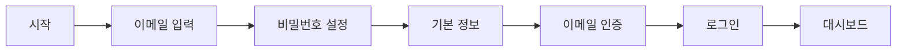

# 사용자용 가이드 (User Guide)

## 목차
- [시작하기](#시작하기)
- [계정 생성 및 인증](#계정-생성-및-인증)
- [증권사 API 연동](#증권사-api-연동)
- [포트폴리오 관리](#포트폴리오-관리)
- [종목 검색 및 추가](#종목-검색-및-추가)
- [자동 매매 전략 설정](#자동-매매-전략-설정)
- [알림 수신 설정](#알림-수신-설정)
- [AI 분석 보고서 활용](#ai-분석-보고서-활용)
- [차트 및 지표 확인](#차트-및-지표-확인)

---

## 시작하기

### StockBoom이란?

**StockBoom**은 주식 투자를 자동화하고 효율적으로 관리할 수 있는 올인원 플랫폼입니다.

**주요 기능**
- 📊 **실시간 주식 데이터**: 한국투자증권 API 및 Yahoo Finance 연동
- 💼 **포트폴리오 관리**: 자산 현황 실시간 확인
- 🤖 **자동 매매**: 기술적 지표 및 AI 기반 자동 거래
- 📈 **기술적 분석**: RSI, MACD, Bollinger Bands 등
- 🔔 **스마트 알림**: 가격 변동, 거래 체결, AI 인사이트 알림
- 📱 **멀티 디바이스**: Web, Mobile 지원 (반응형)

### 접속 방법

**웹 앱**: `http://localhost:3000` (또는 배포된 도메인)

**지원 브라우저**
- Chrome 90+
- Firefox 88+
- Safari 14+
- Edge 90+

---

## 계정 생성 및 인증

### 1. 회원가입

**단계별 가이드**



**1단계: 회원가입 페이지 접속**
- URL: `http://localhost:3000/auth/register`
- "회원가입" 버튼 클릭

**2단계: 정보 입력**

| 필드 | 설명 | 예시 |
|------|------|------|
| **이메일** | 로그인 ID로 사용됩니다 | `user@example.com` |
| **비밀번호** | 최소 6자 이상 | `SecurePass123!` |
| **이름** | 선택사항 | `홍길동` |
| **전화번호** | 선택사항 | `010-1234-5678` |

**3단계: 이메일 인증**
- 가입 완료 후 이메일로 인증 링크 발송
- 링크 클릭하여 이메일 인증 완료

### 2. 로그인

**URL**: `http://localhost:3000/auth/login`

```
이메일: user@example.com
비밀번호: ********
```

**로그인 성공 시**
- JWT 토큰 발급
- 대시보드로 자동 이동

### 3. 2단계 인증 (2FA) 설정

**보안 강화를 위한 2FA 활성화**

**1단계: 설정 페이지 이동**
- 대시보드 → 우측 상단 프로필 → 설정
- "보안" 탭 선택

**2단계: 2FA 활성화**
- "2단계 인증 활성화" 버튼 클릭
- QR 코드 표시

**3단계: 인증 앱 등록**
- Google Authenticator 또는 Authy 앱 실행
- QR 코드 스캔
- 6자리 코드 입력하여 확인

**4단계: 백업 코드 저장**
- 복구 코드 안전한 곳에 보관
- 휴대폰 분실 시 사용

---

## 증권사 API 연동

### 한국투자증권 API 연동

**필요 정보**
- 한국투자증권 계좌
- API 앱 키 (App Key)
- API 앱 시크릿 (App Secret)
- 계좌번호

**연동 절차**

**1단계: API 키 발급**
1. 한국투자증권 홈페이지 로그인
2. [Open API] 메뉴 이동
3. "앱 등록" 클릭
4. 앱 이름 입력 및 약관 동의
5. App Key, App Secret 복사 (안전하게 보관)

**2단계: StockBoom에 연동**
1. 대시보드 → "증권사 계좌" → "계좌 추가"
2. 증권사: `한국투자증권` 선택
3. 정보 입력:
   ```
   계좌번호: 12345678-01
   App Key: YOUR_APP_KEY
   App Secret: YOUR_APP_SECRET
   모의투자 모드: 체크 (실전 거래 전 테스트)
   ```
4. "연동하기" 클릭
5. 연동 성공 메시지 확인

**3단계: 연동 확인**
- 계좌 목록에서 연동 상태 "활성" 확인
- "계좌 동기화" 버튼으로 실시간 잔고 확인

> **⚠️ 중요**: 모의투자 모드에서 충분히 테스트한 후 실전 거래를 시작하세요.

---

## 포트폴리오 관리

### 포트폴리오 생성

**1단계: 포트폴리오 페이지**
- 대시보드 → "포트폴리오" 메뉴

**2단계: 새 포트폴리오 만들기**
```
이름: 메인 포트폴리오
설명: 장기 투자용 포트폴리오
증권사 계좌: 한국투자증권 (12345678-01)
초기 현금: ₩10,000,000
자동 매매: ☑ 활성화
```

**3단계: 포트폴리오 대시보드**

포트폴리오 생성 후 다음 정보를 확인할 수 있습니다:

| 지표 | 설명 |
|------|------|
| **현금 잔고** | 투자 가능한 현금 |
| **총 평가액** | 현금 + 보유 주식 평가액 |
| **총 수익** | 투자 원금 대비 수익금액 |
| **수익률** | 투자 원금 대비 수익률 (%) |
| **보유 종목 수** | 현재 보유 중인 종목 개수 |

**예시 화면**
```
┌─────────────────────────────────────────┐
│  메인 포트폴리오                          │
├─────────────────────────────────────────┤
│  현금 잔고:    ₩5,000,000               │
│  총 평가액:    ₩15,200,000              │
│  총 수익:      ₩3,200,000               │
│  수익률:       +26.7%                    │
│  보유 종목:    5개                       │
└─────────────────────────────────────────┘
```

### 포지션 추가 (종목 매수)

**수동 추가 방법**

1. 포트폴리오 상세 → "포지션 추가"
2. 종목 검색 (예: "삼성전자")
3. 매수 정보 입력:
   ```
   종목: 삼성전자 (005930)
   수량: 10주
   평균 단가: ₩70,000
   ```
4. "추가" 클릭

**자동 매수 (전략 기반)**
- 전략을 설정하면 자동으로 매수 신호 발생 시 거래 실행
- 아래 "자동 매매 전략 설정" 참고

### 평가금액 계산

**자동 계산**
- 실시간으로 현재가 기준 평가금액 자동 계산
- 5분마다 자동 업데이트

**수동 계산**
- "평가금액 계산" 버튼 클릭
- 최신 시세로 즉시 계산

**포지션 상세**

| 종목명 | 보유 수량 | 평균 단가 | 현재가 | 평가액 | 수익/손실 | 수익률 |
|--------|-----------|-----------|--------|--------|-----------|--------|
| 삼성전자 | 10주 | ₩70,000 | ₩72,500 | ₩725,000 | +₩25,000 | +3.6% |
| 카카오 | 5주 | ₩50,000 | ₩48,000 | ₩240,000 | -₩10,000 | -4.0% |

---

## 종목 검색 및 추가

### 종목 검색

**검색 방법**
1. 상단 검색바 또는 "종목 검색" 페이지
2. 검색어 입력:
   - 종목명: `삼성전자`, `카카오`
   - 종목 코드: `005930`, `035720`
3. 검색 결과 확인

**검색 결과**
```
┌────────────────────────────────────────────┐
│ 검색 결과: "삼성"                           │
├────────────────────────────────────────────┤
│ 삼성전자 (005930)                          │
│ KOSPI | 현재가: ₩72,500 (+1.5%)           │
│ [차트 보기] [포트폴리오에 추가]            │
│                                            │
│ 삼성물산 (028260)                          │
│ KOSPI | 현재가: ₩125,000 (-0.8%)          │
│ [차트 보기] [포트폴리오에 추가]            │
└────────────────────────────────────────────┘
```

### 관심 종목 추가

1. 검색 결과에서 "관심 종목 추가" 클릭
2. 대시보드 "관심 종목" 위젯에서 확인
3. 실시간 시세 모니터링

---

## 자동 매매 전략 설정

### 전략 유형

**1. 지표 기반 전략 (INDICATOR_BASED)**
- RSI, MACD, Stochastic 등 기술적 지표 활용
- 설정한 조건에 따라 자동 매매

**2. AI 기반 전략 (AI_BASED)**
- AI 분석 결과 활용
- 패턴 인식, 뉴스 감성 분석

**3. 하이브리드 전략 (HYBRID)**
- 지표와 AI 분석 결합
- 더 정교한 매매 신호

### RSI 전략 예시

**전략 개요**
- **RSI (Relative Strength Index)**: 과매수/과매도 판단 지표
- **매수 신호**: RSI < 30 (과매도)
- **매도 신호**: RSI > 70 (과매수)

**설정 방법**

**1단계: 전략 생성**
- 대시보드 → "전략" → "새 전략 만들기"

**2단계: 기본 정보**
```
전략명: RSI 과매도 전략
설명: RSI 30 이하에서 매수, 70 이상에서 매도
포트폴리오: 메인 포트폴리오
전략 유형: 지표 기반 (INDICATOR_BASED)
```

**3단계: 전략 설정**
```json
{
  "indicator": "RSI",
  "period": 14,
  "oversold": 30,
  "overbought": 70,
  "timeframe": "1d"
}
```

**4단계: 리스크 관리**
```
손절매: -5%  (5% 손실 시 자동 매도)
익절매: +10% (10% 수익 시 자동 매도)
최대 포지션 크기: ₩5,000,000
```

**5단계: 백테스팅**
- "백테스팅 실행" 클릭
- 기간 설정: 2024-01-01 ~ 2024-12-31
- 초기 자본: ₩10,000,000
- 결과 확인:
  ```
  최종 자본: ₩12,500,000
  총 수익률: +25.0%
  승률: 68.5%
  총 거래 횟수: 45
  ```

**6단계: 전략 활성화**
- 백테스팅 결과 만족 시 "활성화" 버튼 클릭
- 실시간 매매 신호 모니터링 시작

### MACD 전략 예시

**전략 개요**
- **MACD**: 추세 및 모멘텀 지표
- **매수 신호**: MACD 선이 Signal 선을 상향 돌파
- **매도 신호**: MACD 선이 Signal 선을 하향 돌파

**전략 설정**
```json
{
  "indicator": "MACD",
  "fastPeriod": 12,
  "slowPeriod": 26,
  "signalPeriod": 9,
  "timeframe": "1h"
}
```

### 전략 평가

**종목에 대한 전략 평가**

1. "전략" 메뉴 → 전략 선택
2. "종목 평가" 클릭
3. 종목 선택 (예: 삼성전자)
4. 평가 결과 확인:
   ```
   현재 신호: BUY
   신호 강도: 75/100
   이유:
   - RSI: 28 (과매도)
   - MACD: 골든 크로스
   - 볼륨: 평균 대비 1.5배
   
   추천: 매수 적극 권장
   ```

---

## 알림 수신 설정

### 알림 유형

| 알림 유형 | 설명 | 예시 |
|-----------|------|------|
| **가격 변동** | 설정한 비율 이상 가격 변동 시 | 삼성전자 +5% 상승 |
| **거래량 급증** | 평균 대비 거래량 급증 시 | 카카오 거래량 3배 증가 |
| **지표 신호** | 기술적 지표 매수/매도 신호 | RSI 과매도 진입 |
| **거래 체결** | 주문 체결 확인 | 삼성전자 10주 매수 체결 |
| **위험 경고** | 손실 확대 또는 위험 증가 | 포트폴리오 손실 -10% |
| **AI 인사이트** | AI 분석 결과 중요 정보 | AI 매수 추천 (신뢰도 85%) |

### 알림 생성

**가격 변동 알림 예시**

**1단계: 알림 페이지**
- 대시보드 → "알림" → "새 알림 만들기"

**2단계: 알림 설정**
```
알림 유형: 가격 변동 (PRICE_CHANGE)
알림 이름: 삼성전자 5% 변동 알림
설명: 삼성전자 가격이 5% 이상 변동 시 알림
```

**3단계: 조건 설정**
```json
{
  "symbol": "005930",
  "changePercent": 5,
  "direction": "BOTH"  // UP, DOWN, BOTH
}
```

**4단계: 알림 채널 선택**
```
☑ 웹 푸시 알림
☑ 이메일
```

**5단계: 저장**
- "알림 생성" 클릭
- 알림 목록에서 확인

### 웹 푸시 알림 설정

**1단계: 브라우저 알림 허용**
- 첫 방문 시 "알림 허용하시겠습니까?" 팝업
- "허용" 클릭

**2단계: 구독 확인**
- 설정 → 알림 → "푸시 알림"
- 구독 상태 "활성" 확인

**3단계: 테스트 알림**
- "테스트 알림 보내기" 클릭
- 브라우저 알림 수신 확인

### 이메일 알림 설정

**1단계: 이메일 주소 확인**
- 설정 → 프로필
- 이메일 주소 확인 및 인증

**2단계: 이메일 알림 활성화**
- 알림 생성 시 "이메일" 체크
- 또는 기존 알림 수정

**알림 예시 (이메일)**
```
제목: [StockBoom] 삼성전자 가격 변동 알림

안녕하세요, 홍길동님

삼성전자(005930)가 5% 상승했습니다.

현재가: ₩75,000 (+5.2%)
변동액: +₩3,700

[포트폴리오 확인하기]
```

---

## AI 분석 보고서 활용

### AI 분석 유형

**1. 뉴스 요약 (NEWS_SUMMARY)**
- 종목 관련 최신 뉴스 분석
- 감성 분석 (긍정/부정/중립)

**2. 위험 점수 (RISK_SCORE)**
- 종목의 위험도 평가 (0-100)
- 변동성, 재무 건전성 등 고려

**3. 패턴 감지 (PATTERN_DETECTION)**
- 차트 패턴 인식
- Head & Shoulders, Double Top/Bottom 등

**4. 포트폴리오 최적화 (PORTFOLIO_OPT)**
- 포트폴리오 구성 최적화 제안
- 리밸런싱 추천

### AI 리포트 확인

**1단계: AI 리포트 페이지**
- 대시보드 → "AI 분석"

**2단계: 종목 선택**
- 관심 종목 선택 (예: 삼성전자)

**3단계: 리포트 확인**

**예시: 삼성전자 AI 분석 리포트**

```
┌────────────────────────────────────────────┐
│ AI 분석 리포트 - 삼성전자 (005930)          │
│ 생성 시간: 2025-01-15 14:30                │
├────────────────────────────────────────────┤
│ 📊 종합 평가                                │
│   추천: 매수 (BUY)                          │
│   신뢰도: 82%                               │
│   위험 점수: 42/100 (중간)                  │
├────────────────────────────────────────────┤
│ 📰 뉴스 감성 분석                           │
│   긍정: 65% | 중립: 25% | 부정: 10%        │
│   최근 긍정 뉴스:                           │
│   - 4분기 실적 개선 전망                    │
│   - 신규 반도체 수주 증가                   │
├────────────────────────────────────────────┤
│ 📈 패턴 감지                                │
│   발견된 패턴: 상승 삼각형 (Ascending)      │
│   신뢰도: 75%                               │
│   예상 방향: 상승 돌파 가능성 높음          │
├────────────────────────────────────────────┤
│ 💡 AI 추천 사항                             │
│   1. 현재 가격대에서 매수 적기              │
│   2. 목표가: ₩78,000 (+7.6%)               │
│   3. 손절가: ₩68,000 (-5.6%)               │
│   4. 예상 보유 기간: 2-4주                  │
└────────────────────────────────────────────┘
```

### AI 신호 기반 알림

**설정 방법**
1. 알림 생성 → "AI 인사이트" 선택
2. 조건 설정:
   ```json
   {
     "minConfidence": 70,
     "recommendationTypes": ["BUY", "STRONG_BUY"]
   }
   ```
3. AI가 높은 신뢰도로 매수를 추천하면 자동 알림

---

## 차트 및 지표 확인

### 차트 보기

**1단계: 종목 상세 페이지**
- 종목 검색 → 종목 선택

**2단계: 차트 시간대 선택**
- 1분, 5분, 15분, 1시간, 1일, 1주

**3단계: 차트 유형**
- 캔들스틱 차트
- 라인 차트
- 영역 차트

**4단계: 지표 추가**
- RSI
- MACD
- Bollinger Bands
- 이동평균선 (SMA, EMA)

### 지표 해석

**RSI (Relative Strength Index)**
```
RSI > 70: 과매수 → 매도 고려
RSI < 30: 과매도 → 매수 고려
RSI 50: 중립
```

**MACD**
```
MACD > Signal: 상승 추세
MACD < Signal: 하락 추세
골든 크로스: 매수 신호
데드 크로스: 매도 신호
```

**Bollinger Bands**
```
가격이 상단 밴드 근처: 고평가 가능성
가격이 하단 밴드 근처: 저평가 가능성
밴드 폭 좁아짐: 큰 움직임 예고
```

---

## 실무 예시: 종목 추가부터 자동 매매까지

### 시나리오: 삼성전자 자동 매매 설정

**목표**: 삼성전자를 RSI 전략으로 자동 매매

**Step 1: 종목 검색 및 추가**
```
1. 종목 검색: "삼성전자"
2. 삼성전자 (005930) 선택
3. "관심 종목 추가" 클릭
```

**Step 2: 포트폴리오에 추가 (선택)**
```
1. 포트폴리오 "메인 포트폴리오" 선택
2. "포지션 추가" 클릭
3. 종목: 삼성전자
4. 수량: 0 (전략으로 자동 매수 예정)
```

**Step 3: RSI 전략 생성**
```
1. "전략" → "새 전략 만들기"
2. 전략명: 삼성전자 RSI 전략
3. 전략 유형: INDICATOR_BASED
4. 설정:
   - 지표: RSI
   - 과매도: 30
   - 과매수: 70
   - 시간대: 1일
5. 리스크:
   - 손절매: -5%
   - 익절매: +10%
   - 최대 포지션: ₩3,000,000
6. 저장 및 활성화
```

**Step 4: 알림 설정**
```
1. "알림" → "새 알림 만들기"
2. 유형: 지표 신호
3. 조건:
   - 종목: 삼성전자
   - 지표: RSI
   - 신호: BUY 또는 SELL
4. 채널: 웹 푸시 + 이메일
5. 저장
```

**Step 5: 모니터링**
```
1. 대시보드에서 실시간 모니터링
2. RSI가 30 이하로 떨어지면:
   - 자동으로 매수 주문 생성
   - 알림 수신
3. 거래 체결 확인:
   - "거래" 메뉴에서 체결 내역 확인
   - 포트폴리오에 포지션 추가됨
4. RSI가 70 이상 또는 익절가 도달 시:
   - 자동으로 매도 주문 생성
   - 수익 실현
```

---

## 자주 묻는 질문 (FAQ)

**Q1: 모의투자와 실전 투자의 차이는?**
- 모의투자: 가상 자금으로 연습, 실제 거래 없음
- 실전 투자: 실제 증권 계좌 연동, 실제 거래 실행

**Q2: 자동 매매가 안전한가요?**
- 손절매/익절매 설정으로 리스크 관리
- 백테스팅으로 전략 검증 필수
- 소액으로 시작하여 테스트 권장

**Q3: 수수료는 어떻게 되나요?**
- 증권사 수수료: 한국투자증권 정책 따름
- StockBoom 이용료: 무료 (현재)

**Q4: 여러 포트폴리오를 운영할 수 있나요?**
- 가능합니다. 용도별로 구분하여 관리

**Q5: 해외 주식도 가능한가요?**
- 현재는 한국 시장 (KOSPI/KOSDAQ) 지원
- 향후 업데이트 예정

**Q6: 데이터는 얼마나 자주 업데이트되나요?**
- 실시간 시세: 5분마다 자동 업데이트
- 수동 갱신: "새로고침" 버튼 사용

**Q7: 알림을 못 받았어요.**
- 웹 푸시: 브라우저 알림 허용 확인
- 이메일: 스팸 폴더 확인
- 설정 → 알림에서 구독 상태 확인

---

## 고객 지원

**기술 지원**
- 이메일: support@stockboom.com
- 카카오톡: @stockboom

**운영 시간**
- 월-금: 09:00 - 18:00
- 주말/공휴일: 휴무

**긴급 문의**
- 시스템 장애 시: emergency@stockboom.com

---

**행복한 투자 되세요! 📈💰**
